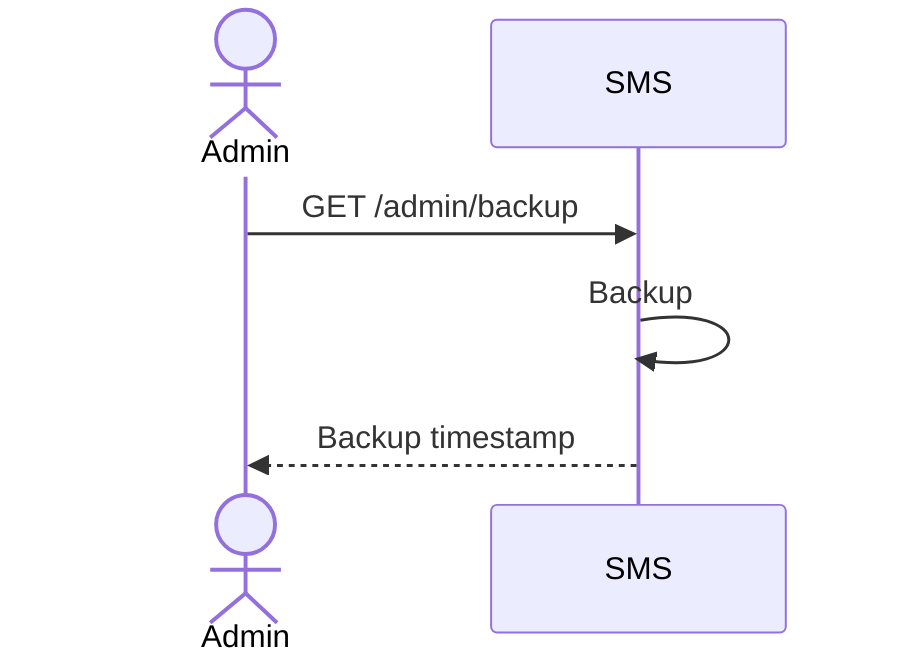
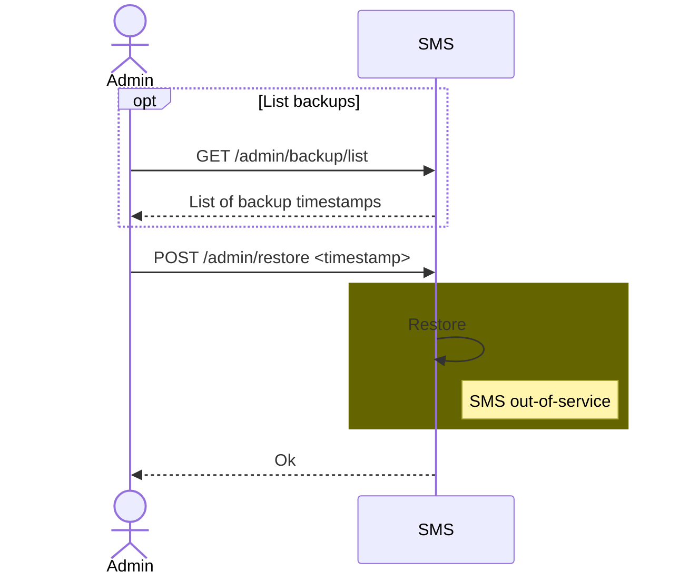
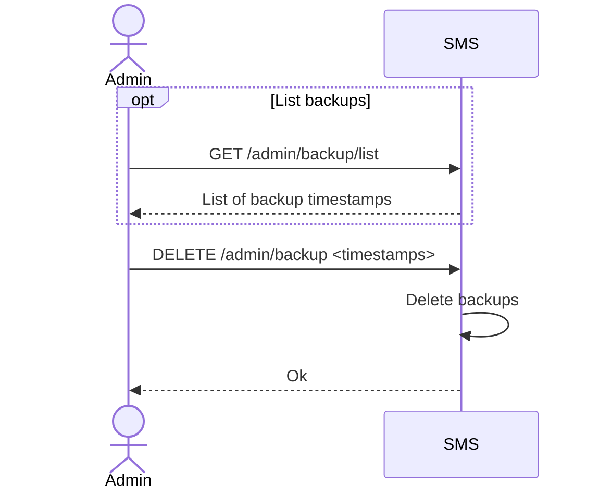
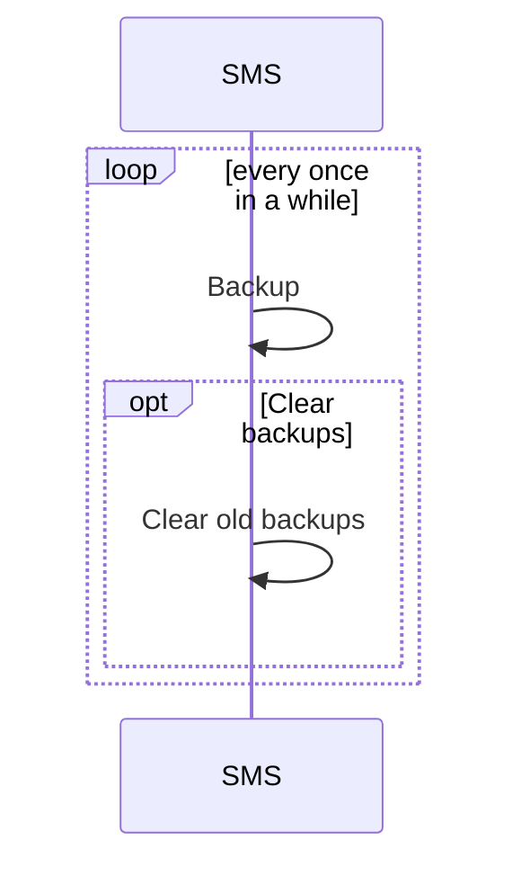
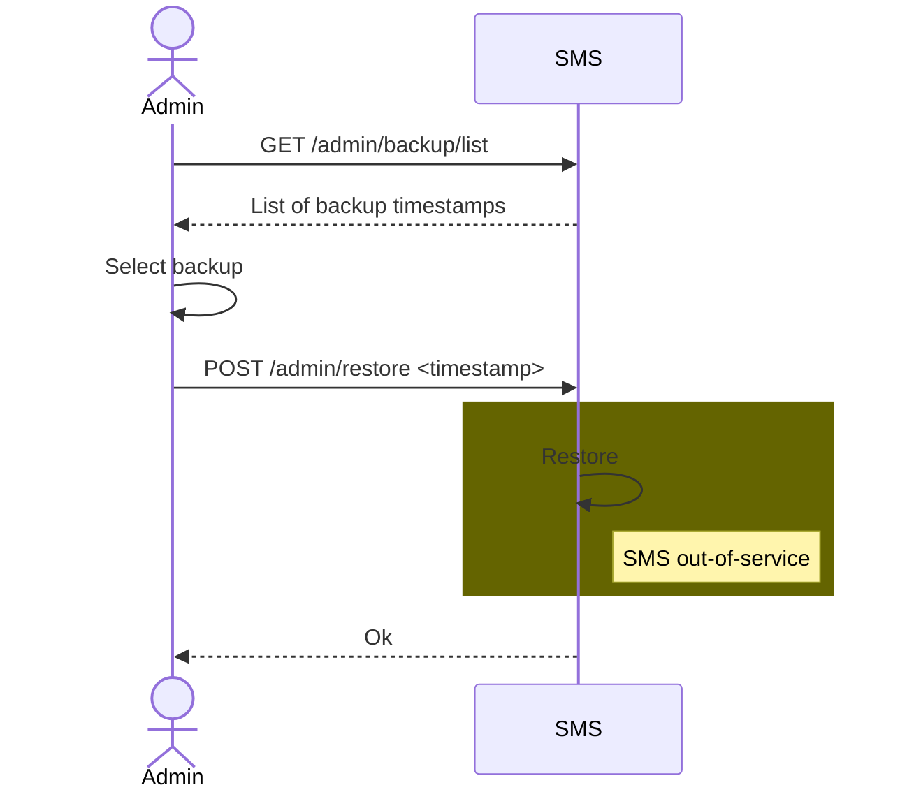

# Backup & restore

## 1. 4 endpoints: backup, list backups, restore & clear backups

List of endpoints:
- `GET /admin/backup`: requires the SMS to execute a backup
- `GET /admin/backup/list`: asks the SMS for the list of available backups
- `POST /admin/restore <timestamp>`: requires the SMS to restore a backup
- `DELETE /admin/backup <timestamps>`: requires the SMS to delete a list of backups

### 1. Sequence diagrams

#### 1. Backup

#### 2. Restore

#### 3. Clear

### 2. Advantages

- A backup can be triggered by an admin when required, meaning the periodicity can easily be changed.

### 3. Drawbacks

- Setting up a periodic backup would mean maintaining another app to regularly call the endpoint.

### 4. Questions

1. Can the admin give a name to a backup? It would make it easier to recognize later on, but it would be a bit trickier to manage.

## 2. Inner periodic update + 2 endpoints: list backups & restore

List of endpoints:
- `GET /admin/backup/list`: asks the SMS for the list of available backups
- `POST /admin/restore <timestamp>`: requires the SMS to restore a backup

### 1. Sequence diagrams

#### 1. Backup & clear

Every once in a while, the SMS backups its data. During this operation, it also deletes the backups that are older than a given age.

#### 2. Restore

### 2. Advantages

- The backups would always be done, without requiring for another app to periodic call an endpoint.
- The SMS manages its own data, meaning it has no need for an external app to clear the old backups.

### 3. Drawbacks

- This system is rigid and can't be easily tuned.
